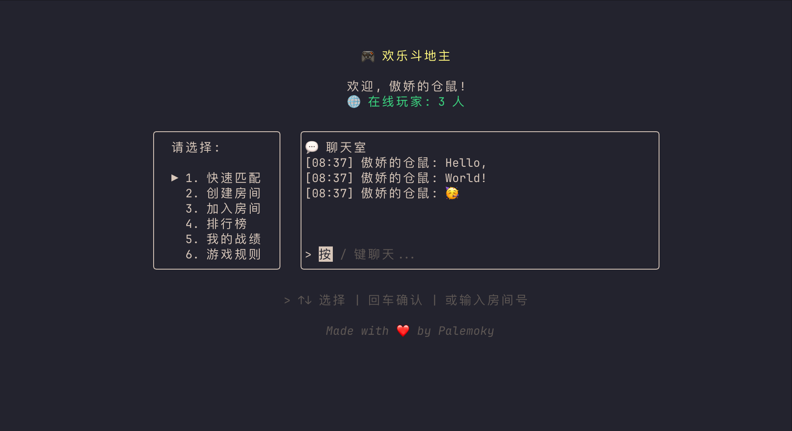
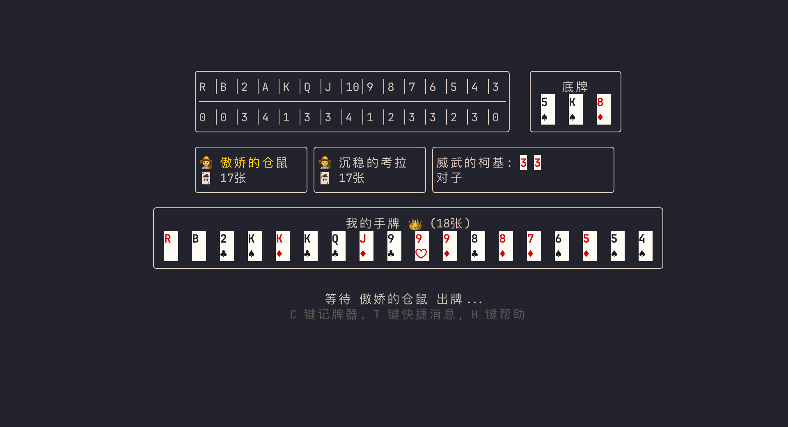

# 🎮 欢乐斗地主 - 完整项目

**一个完整的三人斗地主游戏 - 包含图形界面客户端 + 高性能后端**

<div align="center">

[](https://go.dev/)
[](https://www.cocos.com/creator)
[](LICENSE)

</div>

---

## 📸 游戏截图

<div align="center">
  
  
</div>

---

## ✨ 项目特点

| 特性 | 说明 |
|------|------|
| 🎨 **图形界面** | Cocos Creator 开发，精美动画效果 |
| 🚀 **高性能后端** | Go 语言实现，支持大规模并发 |
| 🌐 **联网对战** | WebSocket 实时通信，三人同场竞技 |
| 🔄 **断线重连** | 网络波动自动重连，游戏状态恢复 |
| 🏠 **房间系统** | 创建房间、加入房间、快速匹配 |
| 🏆 **排行榜** | 积分系统、胜率统计、实时排名 |
| 🔒 **安全防护** | 来源验证、速率限制、IP过滤 |
| 🐳 **容器部署** | Docker Compose 一键部署 |

---

## 🏗️ 项目结构

```
qqddz/
├── server/                     # Go 后端
│   ├── cmd/                    # 程序入口
│   │   ├── server/main.go      # 服务端
│   │   └── client/main.go      # 终端客户端（备用）
│   ├── internal/               # 内部模块
│   │   ├── game/               # 游戏核心逻辑
│   │   ├── server/             # 服务端实现
│   │   ├── protocol/           # 通信协议
│   │   └── ...
│   ├── config.yaml             # 配置文件
│   ├── docker-compose.yml      # Docker 编排
│   ├── deploy.sh               # 一键部署脚本
│   └── start.sh                # 一键启动脚本
│
├── client/                     # Cocos Creator 客户端
│   ├── assets/                 # 游戏资源
│   │   ├── scripts/            # 脚本代码
│   │   ├── resources/          # 图片、音效等
│   │   └── scenes/             # 场景文件
│   ├── project.json            # 项目配置
│   └── ...
│
├── docs/                       # 文档
└── README.md                   # 本文件
```

---

## 🚀 快速开始

### 方式一：Docker 部署（推荐）

```bash
# 1. 进入后端目录
cd server

# 2. 创建配置文件
cp .env.example .env

# 3. 启动服务
docker compose up -d

# 4. 查看日志
docker compose logs -f
```

### 方式二：本地开发

**启动后端：**

```bash
# 1. 安装 Go 1.21+
# macOS: brew install go
# Ubuntu: sudo apt install golang-go

# 2. 安装 Redis
# macOS: brew install redis && brew services start redis
# Ubuntu: sudo apt install redis-server && sudo systemctl start redis

# 3. 启动后端
cd server
go mod download
go run ./cmd/server
```

**启动客户端：**

1. 安装 [Cocos Creator 2.4.x](https://www.cocos.com/creator)
2. 用 Cocos Creator 打开 `client` 目录
3. 修改 `assets/scripts/defines.js` 中的服务器地址：
   ```javascript
   var serverUrl = "ws://localhost:1780/ws"
   ```
4. 点击运行按钮或构建发布

---

## 🎮 游戏操作

| 阶段 | 操作 |
|------|------|
| 叫地主 | 点击"叫地主"或"不叫"按钮 |
| 出牌 | 选择卡牌后点击"出牌"按钮 |
| 不出 | 点击"不出"按钮 |

### 支持的牌型

```
单张: 3, K, 2, 小王, 大王
对子: 33, KK
三张: 333
三带一: 3334
三带二: 33344
顺子: 34567 (5张+)
连对: 334455 (3对+)
飞机: 333444 (2连三+)
飞机带单: 33344456
飞机带对: 3334445566
四带二: 333345
四带两对: 33334455
炸弹: 3333
王炸: 小王+大王
```

---

## 📋 技术栈

### 后端
- **语言**: Go 1.21+
- **通信**: WebSocket + Protocol Buffers / JSON
- **存储**: Redis
- **框架**: 原生实现 + gorilla/websocket

### 客户端
- **引擎**: Cocos Creator 2.4.x
- **语言**: JavaScript
- **通信**: WebSocket + JSON

---

## ⚙️ 配置说明

### 后端配置 (server/config.yaml)

```yaml
server:
  host: "0.0.0.0"
  port: 1780
  max_connections: 10000

redis:
  addr: "localhost:6379"

game:
  turn_timeout: 30      # 出牌超时（秒）
  bid_timeout: 15       # 叫地主超时（秒）
  room_timeout: 10      # 房间超时（分钟）

security:
  allowed_origins:
    - "*"
  rate_limit:
    max_per_second: 10
```

### 客户端配置 (client/assets/scripts/defines.js)

```javascript
// 服务器地址
var serverUrl = "ws://your-server.com:1780/ws"
```

---

## 🔧 开发指南

### 修改协议

后端支持两种消息格式：
- **Protocol Buffers**: 二进制格式，效率更高
- **JSON**: 文本格式，调试更方便

客户端默认使用 JSON 格式。

### 添加新功能

1. 后端：在 `server/internal/server/handler/` 添加消息处理
2. 客户端：在 `client/assets/scripts/data/socket_ctr.js` 添加请求方法

---

## 📊 性能特点

- **并发连接**: 支持 10000+ 并发连接
- **消息延迟**: < 50ms (局域网)
- **流量优化**: Protocol Buffers 压缩，节省 60-80% 流量
- **内存优化**: sync.Pool 对象池复用

---

## 🤝 致谢

- 后端基于 [palemoky/fight-the-landlord](https://github.com/palemoky/fight-the-landlord)
- 客户端基于 [tinyshu/ddz_game](https://github.com/tinyshu/ddz_game)
- UI 框架 [Cocos Creator](https://www.cocos.com/creator)
- WebSocket 库 [gorilla/websocket](https://github.com/gorilla/websocket)

---

## 📜 License

[GPL v3](LICENSE)

---

<div align="center">

**让斗地主回归纯粹 - 无控牌，真公平**

Made with ❤️

</div>
